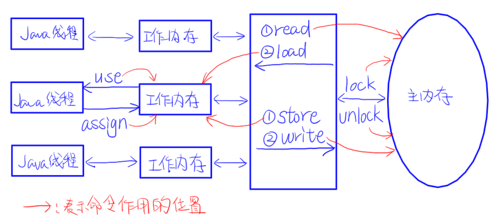

# Java内存模型

## Java内存间的操作

Java中，线程、工作内存、主内存三者的交互关系如下：



通过上图可以发现，Java线程对变量的所有操作（读取、赋值等）都必须在工作内存中进行，不能直接读写主内存中的变量。即使是volatile变量，也是从工作内存中读取的，只是它有特殊的操作顺序规定，使得看起来像是直接在主内存中读写。

**一个变量从主内存拷贝到工作内存，再从工作内存同步回主内存的过程：**

```
|主内存| -> read -> load -> |工作内存| -> user -> |Java线程| -> assign -> |工作内存| -> store -> write -> |主内存|
```

> 注意：read和load，store和write不一定是连续执行的，中间可以插入其他命令

## Java内存模型中的8个原子操作

- `lock`：作用于主内存，把一个变量标识为一个线程独占状态。
- `unlock`：作用于主内存，释放一个处于锁定状态的变量。
- `read`：作用于主内存，把一个变量的值从主内存传输到线程工作内存中，供之后的load操作使用。
- `load`：作用于工作内存，把read操作从主内存中得到的变量值放入工作内存的变量副本中。
- `use`：作用于工作内存，把工作内存中的一个变量传递给执行引擎，虚拟机遇到使用变量值的字节码指令时会执行。
- `assign`：作用于工作内存，把一个从执行引擎得到的值赋给工作内存的变量，虚拟机遇到给变量赋值的字节码指令时会执行。
- `store`：作用于工作内存，把工作内存中的一个变量传送到主内存中，供之后的write操作使用。
- `write`：作用于主内存，把store操作从工作内存中得到的变量值存入主内存的变量中。


## Java内存模型规定在执行上述8个操作时的规则

### 有关变量拷贝过程的规则

- 不允许read和load，store和write单独出现
- 不允许线程丢弃它最近的assign操作，即工作内存变化之后必须把该变化同步回主内存中
- 不允许一个线程在没有assign的情况下将工作内存同步回主内存中
- 新的变量只能从主内存中诞生，即不能在工作内存中使用未被load和assign的变量，一个变量在use和store前一定先经过了load和assign

### 有关加锁的规则

- 一个变量在同一时刻只允许一个线程对其进行lock操作，但是可以被一个线程多次lock（锁的可重入）
- 对一个变量进行lock操作会清空这个变量在工作内存中的值，然后在执行引擎使用这个变量时，需要通过assign或load重新对这个变量进行初始化
- 对一个变量执行unlock前，必须将该变量同步回主内存中，即执行store和write操作
- 一个变量没有被lock，就不能被unlock，也不能去unlock一个被其他线程lock的变量


