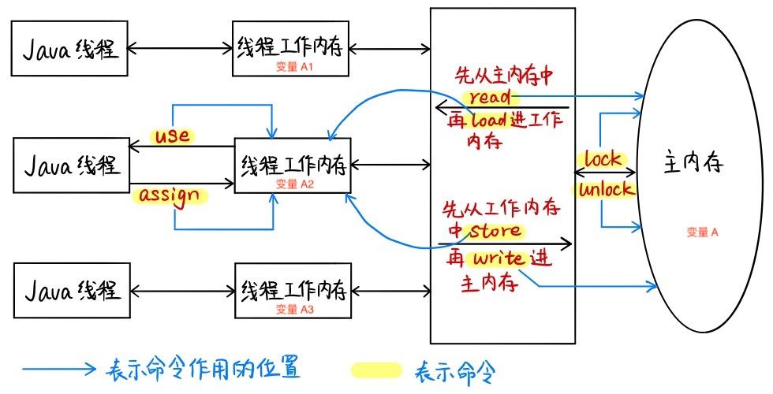
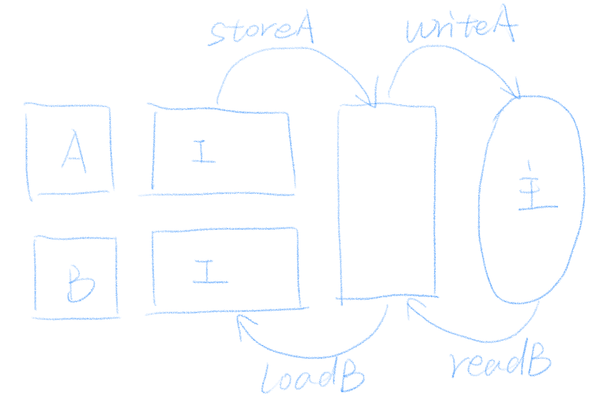

# Java 内存模型

<!-- TOC -->

- [Java 内存模型](#java-内存模型)
    - [Java 内存模型简介](#java-内存模型简介)
    - [Java 内存模型中的 8 个原子操作](#java-内存模型中的-8-个原子操作)
    - [8 个原子操作的执行规则](#8-个原子操作的执行规则)
        - [有关变量拷贝过程的规则](#有关变量拷贝过程的规则)
        - [有关加锁的规则](#有关加锁的规则)
    - [可见性问题 -> 有序性问题](#可见性问题---有序性问题)
    - [Happens-Before 规则](#happens-before-规则)
        - [volatile 的实现原理](#volatile-的实现原理)
            - [1. 保证动作发生](#1-保证动作发生)
            - [2. 保证动作按正确的顺序发生](#2-保证动作按正确的顺序发生)
            - [volatile 的真实实现](#volatile-的真实实现)

<!-- /TOC -->

为了更好的理解 Java 是如何实现 **按需禁用缓存和编译优化** 的，我们首先需要对 Java 的内存模型有一个初步的了解。

## Java 内存模型简介

Java 内存模型主要由以下三部分构成：**1 个主内存、n 个线程、n 个工作内存（与线程一一对应）**，数据就在它们三者之间来回倒腾。那么怎么倒腾呢？靠的是 Java 提供给我们的 8 个原子操作：`lock`、`unlock`、`read`、`load`、`use`、`assign`、`store`、`write`，其操作流程示意图如下：



**一个变量从主内存拷贝到工作内存，再从工作内存同步回主内存的流程为：**

```
|主内存| -> read -> load -> |工作内存| -> use -> |Java线程| -> assign -> |工作内存| -> store -> write -> |主内存|
```

其中，8 个原子操作的详细介绍如下。

## Java 内存模型中的 8 个原子操作

- `lock`：作用于主内存，把一个变量标识为一个线程独占状态。
- `unlock`：作用于主内存，释放一个处于锁定状态的变量。
- `read`：作用于主内存，把一个变量的值从主内存传输到线程工作内存中，供之后的 `load` 操作使用。
- `load`：作用于工作内存，把 `read` 操作从主内存中得到的变量值放入工作内存的变量副本中。
- `use`：作用于工作内存，把工作内存中的一个变量传递给执行引擎，虚拟机遇到使用变量值的字节码指令时会执行。
- `assign`：作用于工作内存，把一个从执行引擎得到的值赋给工作内存的变量，虚拟机遇到给变量赋值的字节码指令时会执行。
- `store`：作用于工作内存，把工作内存中的一个变量传送到主内存中，供之后的 `write` 操作使用。
- `write`：作用于主内存，把 `store` 操作从工作内存中得到的变量值存入主内存的变量中。

## 8 个原子操作的执行规则

### 有关变量拷贝过程的规则

- 不允许 `read` 和 `load`，`store` 和 `write` 单独出现
- 不允许线程丢弃它最近的 `assign` 操作，即工作内存变化之后必须把该变化同步回主内存中
- 不允许一个线程在没有 `assign` 的情况下将工作内存同步回主内存中，也就是说，只有虚拟机遇到变量赋值的字节码时才会将工作内存同步回主内存
- 新的变量只能从主内存中诞生，即不能在工作内存中使用未被 `load` 和 `assign` 的变量，一个变量在 `use` 和 `store` 前一定先经过了 `load` 和 `assign`

### 有关加锁的规则

- 一个变量在同一时刻只允许一个线程对其进行 `lock` 操作，但是可以被一个线程多次 `lock`（锁的可重入）
- 对一个变量进行 `lock` 操作会清空这个变量在工作内存中的值，然后在执行引擎使用这个变量时，需要通过 `assign` 或 `load` 重新对这个变量进行初始化
- 对一个变量执行 `unlock` 前，必须将该变量同步回主内存中，即执行 `store` 和 `write` 操作
- 一个变量没有被 `lock`，就不能被 `unlock`，也不能去 `unlock`一个被其他线程 `lock` 的变量

## 可见性问题 -> 有序性问题

通过上图可以发现，Java 线程只能操作自己的工作内存，其对变量的所有操作（读取、赋值等）都必须在工作内存中进行，不能直接读写主内存中的变量。这就有可能会导致可见性问题：

- 因为对于主内存中的变量 A，其在不同的线程的工作内存中可能存在不同的副本 A1、A2、A3。
- **不同线程的 `read` 和 `load`、`store` 和 `write` 不一定是连续执行的，中间可以插入其他命令**。Java 只能保证 `read` 和 `load`、`store` 和 `write` 的执行对于一个线程而言是连续的，但是并不保证不同线程的 `read` 和 `load`、`store` 和 `write` 的执行是连续的，如下图：假设有两个线程 A 和 B，其中线程 A 在写入共享变量，线程 B 要读取共享变量，我们想让线程 A 先完成写入，线程 B 再完成读取。此时即便我们是按照 “线程 A 写入 -> 线程 B 读取” 的顺序开始执行的，真实的执行顺序也可能是这样的：`storeA -> readB -> writeA -> loadB`，这将导致线程 B 读取的是变量的旧值，而非线程 A 修改过的新值。**也就是说，线程 A 修改变量的执行先于线程 B 操作了，但这个操作对于线程 B 而言依旧是不可见的**。

那么如何解决这个问题呢？通过上述的分析可以发现，**可见性问题的本身，也是由于不同线程之间的执行顺序得不到保证导致的**，因此我们也可以将它的解决和有序性合并，即对 Java 一些指令的操作顺序进行限制，这样既保证了有序性，有解决了可见性。

于是乎，Java 给出了一些命令执行的顺序规范，也就是大名鼎鼎 Happens-Before 规则。

## Happens-Before 规则

根据语义，Happens-Before，就是即便是对于不同的线程，前面的操作也应该发生在后面操作的前面，也就是说，**Happens-Before 规则保证：前面的操作的结果对后面的操作一定是可见的**。

**Happens-Before 规则本质上是一种顺序约束规范，用来约束编译器的优化行为**。就是说，为了执行效率，我们允许编译器的优化行为，但是为了保证程序运行的正确性，我们要求编译器优化后需要满足 Happens-Before 规则。

根据类别，我们将 Happens-Before 规则分为了以下 4 类：

- 操作的顺序：
	- **程序顺序规则：** 如果代码中操作 A 在操作 B 之前，那么同一个线程中 A 操作一定在 B 操作前执行，即在本线程内观察，所有操作都是有序的。
	- **传递性：** 在同一个线程中，如果 A 先于 B ，B 先于 C 那么 A 必然先于 C。
- 锁和 volatile：
	- **监视器锁规则：** 监视器锁的解锁操作必须在同一个监视器锁的加锁操作前执行。
	- **volatile 变量规则：** 对 volatile 变量的写操作必须在对该变量的读操作前执行，保证时刻读取到这个变量的最新值。
- 线程和中断：
	- **线程启动规则：** `Thread#start()` 方法一定先于该线程中执行的操作。
	- **线程结束规则：** 线程的所有操作先于线程的终结。
	- **中断规则：** 假设有线程 A，其他线程 interrupt A 的操作先于检测 A 线程是否中断的操作，即对一个线程的 `interrupt()` 操作和 `interrupted()` 等检测中断的操作同时发生，那么 `interrupt()` 先执行。
- 对象生命周期相关：
	- **终结器规则：** 对象的构造函数执行先于 `finalize()` 方法。

> 我第一次看到 Happens-Before 规则是在《Java 并发编程实战》这本书上，看的时候很是懵逼，根本不知道这一溜规则是用来干什么的。现在想来，这其实就像是玩推理游戏一样，一般会给定一些一定成立的前提，然后我们根据这些前提再推理其他的结论。而 Happens-Before 规则就相当于这些给定的前提。
> 
> 由于并发程序执行的过程中，有太多的不确定性了，使得我们很难推断和分析这些跑在机器上的程序，到底是怎么运行的？而 Happens-Before 规则的作用，就是辅助我们推理程序的实际运行的。
> 
> 就是说，Java 的开发者已经向我们承诺了，Java 严格准守了 Happens-Before 规则中的每一条，至于具体怎么实现的，我们可以不去深究。作为使用这门语言的应用开发者，我们只需知道这些规则是一定成立的，并且通过这些规则能推断、理解程序的运行结果就可以啦。

### volatile 的实现原理

这里比较有趣的是有关 volatile 的规则，volatile 变量有以下两个特点：
- 保证对所有线程的可见性。
- 禁止指令重排序优化。

我之前一直以为，如果一个变量被标记成了 volatile 变量，那么这个变量的值就不会被加载进线程的工作内存中，而是直接在主内存上进行读写。

实际上并不是这样的，因为这样我们需要为 volatile 变量的读写设置一套特殊的规则，这显然是不合适。即使是 volatile 变量，也是从工作内存中读取的，只是它有特殊的操作顺序规定，使得看起来像是直接在主内存中读写。

Happens-Before 规则中要求，对 volatile 变量的写操作必须在对该变量的读操作前执行，这个规则听起来很容易，那实际上是如何实现的呢？解决方法分两步：
1. 保证动作发生；
2. 保证动作按正确的顺序发生。

#### 1. 保证动作发生

首先，在对 volatile 变量进行读取和写入操作，必须去主内存拉取最新值，或是将最新值更新进主内存，不能只更新进工作内存而不将操作同步进主内存，即在执行 `read`、`load`、`use`、`assign`、`store`、`write` 操作时：

- `use` 操作必须与 `load`、`read` 操作同时出现，不能只 `use`，不 `load`、`read`。
	- `use` <- `load` <- `read`
- `assign` 操作必须与 `store`、`write` 操作同时出现，不能只 `assign`，不 `store`、`write`。
	- `assign` -> `store` -> `write`

此时，我们已经保证了将变量的最新值时刻同步进主内存的动作发生了，接下来，我们需要保证这个动作，对于不同的线程，满足 volatile 变量的 Happens-Before 规则：对变量的写操作必须在对该变量的读操作前执行。

#### 2. 保证动作按正确的顺序发生

其实，导致这个执行顺序问题的主要原因在于，这个读写 volatile 变量的操作不是一气呵成的，它不是原子的！无论是读还是写，它都分成了 3 个命令（`use` <- `load` <- `read` 或 `assign` -> `store` -> `write`），这就导致了，你能保证 `assignA` 发生在 `useB` 之前，但你根本不能保证 `writeA` 也发生在 `useB` 之前，而如果 `writeA` 不发生在 `useB` 之前，主内存中的数据就是旧的，线程 B 就读不到最新值！

所以，我觉得这句话应当换一个理解方式：假设我是一个写操作，你发生在我之前的读操作可以随便执行，各个分解命令先于我还是后于我都无所谓。**但是，你发生在我之后的读操作，必须等我把 3 个命令都执行完，才能执行！不许偷偷把一些指令排到我的最后一个指令的前面去。** 这才是 “对变量的写操作必须在对该变量的读操作前执行” 的本质。

#### volatile 的真实实现

那么 Java 是如何利用现有的工具，实现了上述的两个效果的呢？

答案是：它巧妙的利用了 `lock` 操作的特点，通过 **观察对 volatile 变量的赋值操作的反编译代码，我们发现，在执行了变量赋值操作之后，额外加了一行：**

```x86asm
lock addl $0x0,(%esp)
```

这一句的意思是：给 ESP 寄存器 `+0`，这是一个无意义的空操作，**重点在 `lock` 上**：

- **保证动作发生：**
    - **`lock` 指令会将当前 CPU 的 Cache 写入内存，并无效化其他 CPU 的 Cache，相当于在执行了 `assign` 后，又进行了 `store` -> `write`**；
    - 这使得其他 CPU 可以立即看见 volatile 变量的修改，因为**其他 CPU 在读取 volatile 变量时，会发现自己的缓存过期了，于是会去主内存中拉取最新的 volatile 变量值，也就被迫在 `use` 前进行一次 `read` -> `load`**。
- **保证动作顺序：**
    - `lock` 的存在相当于一个内存屏障，使得在重排序时，不能把后面的指令排在内存屏障之前。

这个实现是不是十分的巧妙呀~
