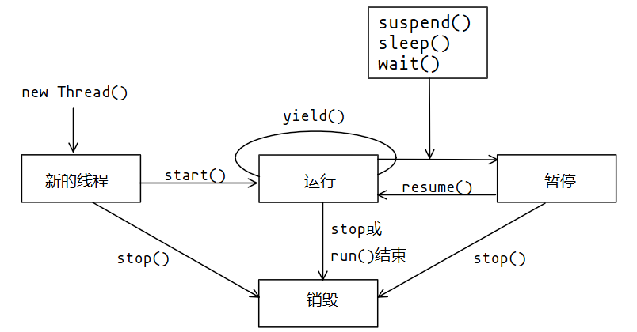

# Java线程

## 线程的实现

### 线程的描述

- 线程是比进程更轻量级的调度执行单位，CPU调度的基本单位就是线程。
- 线程的引入，将一个进程的资源分配和执行调度分开。
- 各个线程既可以共享进程资源（内存地址、文件I/O等），又可独立调度。
- **Java的Thread类：** 所有关键方法都是Native的，说明这些方法无法使用平台无关的手段实现。

### 实现线程的3种方式

- 使用内核线程实现
- 使用用户线程实现
- 使用用户线程加轻量级进程

## 线程的调度

- **协同式线程调度：** 线程的执行时间由线程本身来控制，线程执行完自己的任务之后，主动通知系统切换到另一个线程。
  - 优点：实现简单，没有线程同步的问题。
  - 缺点：线程执行时间不可控，如果一个线程编写有问题一直无法结束，程序会一直阻塞在那里。
- **抢占式线程调度：** 每个线程由系统分配执行时间，系统决定切不切换线程。

## 线程的状态转换

