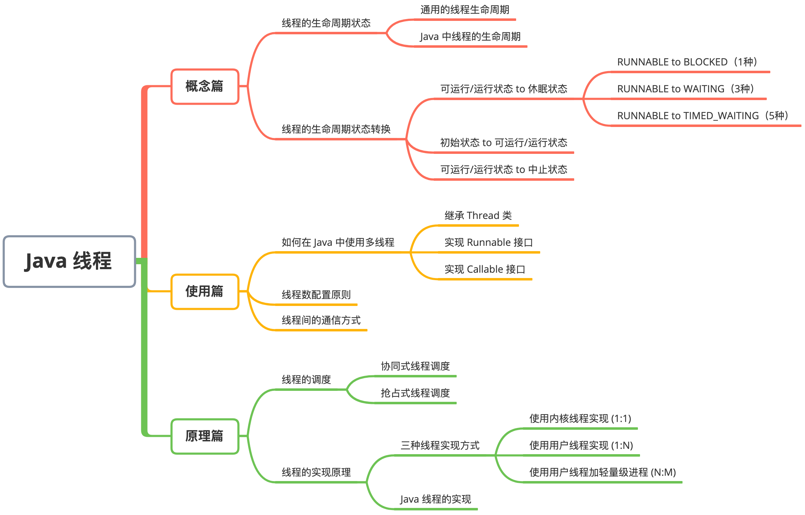

# Java 线程

- 线程是比进程更轻量级的调度执行单位，CPU 调度的基本单位就是线程。
- 线程的引入，将一个进程的资源分配和执行调度分开。
- 各个线程既可以共享进程资源（内存地址、文件 I/O 等），又可独立调度。

#### Java 线程学习地图

#### Content

- [Java线程：概念篇](./01-Java线程/01-Java线程-概念篇.md)
- [Java线程：使用篇](./01-Java线程/01-Java线程-使用篇.md)
- [Java线程：原理篇](./01-Java线程/01-Java线程-原理篇.md)

