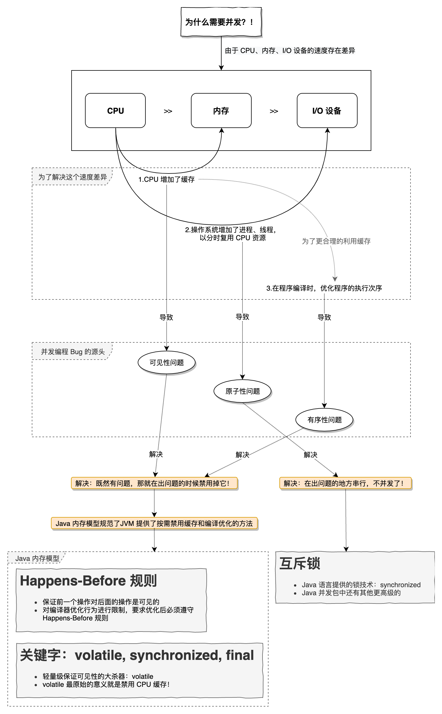

# 并发编程 Bug 的源头

### 线程安全性

首先我们要明确，线程安全性的定义中，**最核心的概念就是正确性！！！**（重要的事情感叹三遍）。当正确性无法得到保证时，Bug 便出现了。

一个线程安全的类，就是当**多个线程访问它时，这个类始终都能表现出正确的行为。**

## 原子性、可见性与有序性

### 原子性

- 给用户提供了字节码指令：monitorenter 和 monitorexit 来隐式的使用 lock 和 unlock。
- 这两个字节码反映到 Java 代码中就是同步块：synchronized。

### 可见性

- 当一条线程修改了共享变量的值，其他线程可以立即得知这个修改。
- 实现方式：在变量修改后将新值同步回主内存，在变量读取前从主内存刷新变量值的方式实现，依赖主内存作为传输媒质。
- 可以保证可见性的关键字：
  - `volatile`：通过 volatile 的特殊规则；
  - `synchronized`：通过“对一个变量执行 unlock 操作前，必须将该变量同步回主内存”这条规则。
  - `final`：被 final 修饰的字段，一旦完成了初始化，其他线程就能看到它，并且它也不会再变了。
    - 即只要不可变对象被正确的构建出来（没有发生 this 引用溢出），它就是线程安全的。

### 有序性

- 如果在本线程内观察，所有操作都是有序的。
  - 即 Java 内存模型会保证重排序后的执行，在线程内看起来和串行的效果是一样的。
- 如果在一个线程观察另一个线程，所有操作都是无序的。
- 可以保证有序性的关键字：
  - volatile：本身禁止指令重排序；
  - synchronized：通过保证线程的串行执行来保证有序性，因为“线程内表现为串行的语义”。
- 如果两个操作之间缺乏 Happens-Before 规则，那么 JVM 可对它们任意地排序。
