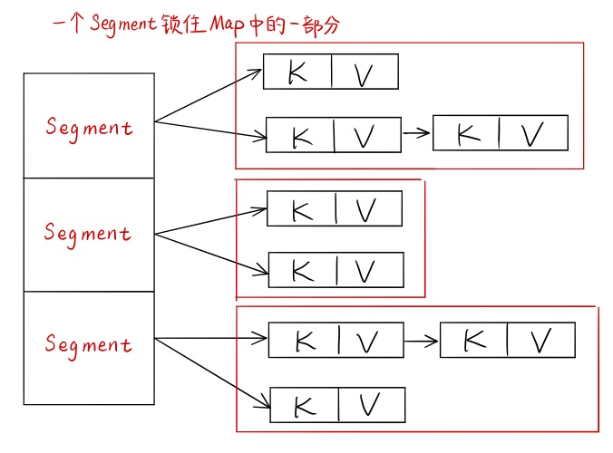

# 常用的并发基础构建模块

[TOC]

<!-- TOC -->

- [常用的并发基础构建模块](#%E5%B8%B8%E7%94%A8%E7%9A%84%E5%B9%B6%E5%8F%91%E5%9F%BA%E7%A1%80%E6%9E%84%E5%BB%BA%E6%A8%A1%E5%9D%97)
  - [同步容器类](#%E5%90%8C%E6%AD%A5%E5%AE%B9%E5%99%A8%E7%B1%BB)
  - [并发容器类](#%E5%B9%B6%E5%8F%91%E5%AE%B9%E5%99%A8%E7%B1%BB)
    - [ConcurrentHashMap](#concurrenthashmap)
      - [特点](#%E7%89%B9%E7%82%B9)
      - [锁分段实现原理](#%E9%94%81%E5%88%86%E6%AE%B5%E5%AE%9E%E7%8E%B0%E5%8E%9F%E7%90%86)
      - [注意](#%E6%B3%A8%E6%84%8F)
    - [CopyOnWriteArrayList](#copyonwritearraylist)
  - [并发工具类](#%E5%B9%B6%E5%8F%91%E5%B7%A5%E5%85%B7%E7%B1%BB)
    - [BlockingQueue](#blockingqueue)
      - [Java 中支持的阻塞队列](#java-%E4%B8%AD%E6%94%AF%E6%8C%81%E7%9A%84%E9%98%BB%E5%A1%9E%E9%98%9F%E5%88%97)
      - [阻塞队列的实现原理](#%E9%98%BB%E5%A1%9E%E9%98%9F%E5%88%97%E7%9A%84%E5%AE%9E%E7%8E%B0%E5%8E%9F%E7%90%86)
    - [CountDownLatch](#countdownlatch)
      - [API](#api)
      - [使用 CountDownLatch 替代 join()](#%E4%BD%BF%E7%94%A8-countdownlatch-%E6%9B%BF%E4%BB%A3-join)
    - [CyclicBarrier](#cyclicbarrier)
      - [API](#api-1)
      - [Demo](#demo)
    - [Semaphore](#semaphore)
      - [API](#api-2)
      - [Demo](#demo-1)
    - [Exchanger](#exchanger)
      - [API](#api-3)
      - [Demo](#demo-2)

<!-- /TOC -->

## 同步容器类

是一类将对应容器的状态都封装起来，并对每个共有方法都进行同步（加synchronized关键字修饰）的类，相当于让所有对容器的状态的访问串行化，虽然安全但是并发性差。

- Vector
- HashTable

对容器进行迭代操作时，我们要考虑它是不是会被其他的线程修改，如果是我们自己写代码，可以考虑通过如下方式对容器的迭代操作加锁：

```java
synchronized (vector) {
    for (int i = 0; i < vector.size(); i++)
        doSomething(vector.get(i));
}
```

不过 Java 自己的同步容器类并没有考虑并发修改的问题，它主要采用了一种**及时失败**的方法，即一旦容器被其他线程修改，它就会抛出异常，例如 Vector 类，它的内部实现是这样的：

`Vector#iterator()`会返回一个 Vector 的内部类`Itr implement Iterator<E>`，在 Itr 的`next()`和`remove()`方法中有如下代码：

```java
synchronized (Vector.this) { // 类名.this：在内部类中，要用到外围类的this对象，使用“外围类名.this”
    checkForComodification();	// 在进行next和remove操作前，会先检查以下容器是否被修改
    ...
}

/* checkForComodification()方法 */
final void checkForComodification() {
    if (modCount != expectedModCount) // 在Itr的成员变量中有一个：int exceptedModCount = modCount;
        throw new ConcurrentModificationException(); // 如果容器被修改了，modCount会变
}
```

因此，我们在调用 Vector 的如下方法时，要小心，因为它们会隐式的调用 Vector 的迭代操作。

- toString
- hashCode
- equals
- containsAll
- removeAll
- retainAll
- 容器作为参数的构造函数


## 并发容器类

通过上一小节的分析，我们发现同步容器类的性能实在太差，所以我们可以通过并发容器类代替同步容器类，来提高系统的可伸缩性。我们主要介绍`ConcurrentHashMap`和`CopyOnWriteArrayList`。

### ConcurrentHashMap

#### 特点

- ConcorrentHashMap 实现了 ConcorrentMap 接口，能在并发环境实现更高的吞吐量，而在单线程环境中只损失很小的性能；
- 采用分段锁，使得任意数量的读取线程可以并发地访问 Map，一定数量的写入线程可以并发地修改 Map；
- 不会抛出 ConcorrentModificationException，它返回迭代器具有“弱一致性”，即可以容忍并发修改，但不保证将修改操作反映给容器；
- size() 的返回结果可能已经过期，只是一个估计值，不过 size() 和 isEmpty() 方法在并发环境中用的也不多；
- 提供了许多原子的复合操作：
	- `V putIfAbsent(K key, V value);`：K 没有相应映射才插入
	- `boolean remove(K key, V value);`：K 被映射到 V 才移除
	- `boolean replace(K key, V oldValue, V newValue);`：K 被映射到 oldValue 时才替换为 newValue

**ConcurrentHashMap 内部结构：**



- 在构造的时候，Segment 的数量由所谓的 concurrentcyLevel 决定，默认是 16；
- Segment 是基于 ReentrantLock 的扩展实现的，在 put 的时候，会对修改的区域加锁。

#### 锁分段实现原理

**锁分段：**
不同线程在同一数据的不同部分上不会互相干扰，例如，ConcurrentHashMap 支持 16 个并发的写入器，是用 16 个锁来实现的。它的实现原理如下：

- 使用了一个包含 16 个锁的数组，每个锁保护所有散列桶的 1/16，其中第 N 个散列桶由第（N % 16）个锁来保护；
- 这大约能把对于锁的请求减少到原来的 1/16，也是 ConcurrentHashMap 最多能支持 16 个线程同时写入的原因；
- 对于 ConcurrentHashMap 的 size() 操作，为了避免枚举每个元素，ConcurrentHashMap 为每个分段都维护了一个独立的计数，并通过每个分段的锁来维护这个值，而不是维护一个全局计数；
- 代码示例：

	```java
	public class StripedMap {
	    // 同步策略：buckets[n]由locks[n % N_LOCKS]保护
	    private static final int N_LOCKS = 16;
	    private final Node[] buckets;
	    private final Object[] locks; // N_LOCKS个锁
	    private static class Node {
	        Node next;
	        Object key;
	        Object value;
	    }
	    public StripedMap(int numBuckets) {
	        buckets = new Node[numBuckets];
	        locks = new Object[N_LOCKS];
	        for (int i = 0; i < N_LOCKS; i++)
	            locks[i] = new Object();
	    }
	    private final int hash(Object key) {
	        return Math.abs(key.hashCode() % buckets.length);
	    }
	    public Object get(Object key) {
	        int hash = hash(key);
	        synchronized (locks[hash % N_LOCKS]) { // 分段加锁
	            for (Node m = buckets[hash]; m != null; m = m.next)
	                if (m.key.equals(key))
	                    return m.value;
	        }
	        return null;
	    }
	    public void clear() {
	        for (int i = 0; i < buckets.length; i++) {
	            synchronized (locks[i % N_LOCKS]) { // 分段加锁
	                buckets[i] = null;
	            }	
	        }
	    }
	}
	```

#### 注意

- **关于 put 操作：**
	- 是否需要扩容
		- 在插入元素前判断是否需要扩容，
		- 比 HashMap 的插入元素后判断是否需要扩容要好，因为可以插入元素后，Map 扩容，之后不再有新的元素插入，Map就进行了一次无效的扩容
	- 如何扩容
	  - 先创建一个容量是原来的2倍的数组，然后将原数组中的元素进行再散列后插入新数组中
	  - 为了高效，ConcurrentHashMap 只对某个 segment 进行扩容
- **关于 size 操作：**
	- 存在问题：如果不进行同步，只是计算所有 Segment 维护区域的 size 总和，那么在计算的过程中，可能有新的元素 put 进来，导致结果不准确，但如果对所有的 Segment 加锁，代价又过高。
	- 解决方法：重试机制，通过获取两次来试图获取 size 的可靠值，如果没有监控到发生变化，即 `Segment.modCount` 没有变化，就直接返回，否则获取锁进行操作。

### CopyOnWriteArrayList

- 只要正确发布了这个 list，它就是不可变的了，所以随便并发访问，当需要修改时，就创建一个新的容器副本替代原来的，以实现可变性；
- 应用于迭代操作远多于修改操作的情形，如：事件通知系统，分发通知时需要迭代已注册监听器链表，并调用每一个监听器，一般注册和注销事件监听器的操作远少于接收事件通知的操作。


## 并发工具类

可以根据自身状态协调线程的控制流：

- 生产者消费者模式：阻塞队列（BlockingQueue）
- 并发流程控制：
	- 闭锁（CountDownLatch）
	- 栅栏（Barrier）
	- 信号量（Semaphore）
- 线程间的数据交换：交换者（Exchanger）

### BlockingQueue

BlockingQueue 提供了可阻塞的 put 和 take 方法：(都是阻塞方法，会抛出 InterruptException 异常)

- 如果队列为空，take 方法一直被阻塞，直到队列中出现一个可用元素
- 如果队列已满，put 方法一直被阻塞，直到队列中出现可用空间

是设计 “生产者 -- 消费者模式” 的利器！

#### Java 中支持的阻塞队列

| 阻塞队列类              | 结构 | 界 | 特点 |
| --------------------- | ---- | ---- | --------------------- |
| ArrayBlockingQueue    | 数组 | 有 | FIFO |
| LinkedBlockingQueue   | 链表 | 有 | FIFO |
| PriorityBlockingQueue | 优先队列 | 无 | 按优先级先后出队 |
| DelayQueue    | 使用优先队列实现 | 无 | 向队列中 put 元素时指定多久才能从队列中获取当前元素，只有当延时时间到了，才能从队列中获取该元素，队列元素要实现 Delayed 接口，可以用来设计缓存系统 |
| SynchronousQueue      | 不存储元素的阻塞队列 | 有 | 每一个 put 操作等待一个 take 操作，否则无法继续添加元素 |
| LinkedTransferQueue   | 链表 | 无 | `transfer()`：如果当前有在等待接收元素的消费者，可以把新元素直接给消费者，没有则阻塞；`tryTransfer()`：如果没有消费者等待会返回 false；它们的区别就在于会不会立即返回 |
| LinkedBlockDeque      | 链表（双向队列） | 有 | 双向队列可用来实现工作密取模式，即如果一个消费者完成了自己的 Deque 中的全部任务，它可以偷偷的去其他消费者的 Deque 的尾部获取工作，以保证所有线程都处于忙碌状态，可应用于爬虫。 |

#### 阻塞队列的实现原理

对于阻塞队列的实现原理，我们最关注的是其通知模式的实现，即 BlockingQueue 是如何在队列满时通知 put 操作等待，和如何在队列空时通知 take 操作等待的。

我们可以通过阅读 ArrayBlockingQueue 的源码得知：

- ArrayBlockingQueue 中有**一个 ReentrantLock lock**；
- 这个 lock 给我们提供了**两个 Condition：notEmpty 和 notFull**；
- **take 操作中**，会以 while 循环的方式轮询 count == items.length，如果为 true，就 **notFull.await()**，这个阻塞状态需要通过 **dequeue 方法中**的 **notFull.signal()** 来解除；
- **put 操作中**，会以 while 循环的方式轮询 count == 0，如果为 true，就 **notEmpty.await()**，这个阻塞状态需要通过 **enqueue 方法中**的 **notEmpty.signal()** 来解除。

```java
public class ArrayBlockingQueue<E> extends AbstractQueue<E>
		implements BlockingQueue<E>, java.io.Serializable {
	int count;  // 队列中元素的个数
	final ReentrantLock lock;  // 下面的两个Condition绑定在这个锁上
	private final Condition notEmpty;  // 用来等待take的条件
	private final Condition notFull;  // 用来等待put的条件
	
	public ArrayBlockingQueue(int capacity, boolean fair) {
        // 省略...
        lock = new ReentrantLock(fair);
        notEmpty = lock.newCondition();
        notFull =  lock.newCondition();
    }
    
    public void put(E e) throws InterruptedException {
        checkNotNull(e);
        final ReentrantLock lock = this.lock;
        lock.lockInterruptibly();  // 加可中断锁
        try {
            while (count == items.length)
                notFull.await();  // 轮询count值，等待count < items.length
            enqueue(e);  // 包含notFull.signal();
        } finally {
            lock.unlock();
        }
    }
    
    public E take() throws InterruptedException {
        final ReentrantLock lock = this.lock;
        lock.lockInterruptibly();
        try {
            while (count == 0)
                notEmpty.await();  // 轮询count值，等待count > 0
            return dequeue();  // 包含notEmpty.signal();
        } finally {
            lock.unlock();
        }
    }
    
    private void enqueue(E x) {
        // assert lock.getHoldCount() == 1;
        // assert items[putIndex] == null;
        final Object[] items = this.items;
        items[putIndex] = x;
        if (++putIndex == items.length)
            putIndex = 0;
        count++;
        notEmpty.signal();  // 会唤醒在等待的take操作
    }
    
    private E dequeue() {
        // assert lock.getHoldCount() == 1;
        // assert items[takeIndex] != null;
        final Object[] items = this.items;
        @SuppressWarnings("unchecked")
        E x = (E) items[takeIndex];
        items[takeIndex] = null;
        if (++takeIndex == items.length)
            takeIndex = 0;
        count--;
        if (itrs != null)
            itrs.elementDequeued();
        notFull.signal();  // 会唤醒在等待的put操作
        return x;
    }
}
```

### CountDownLatch

可以让一个或多个线程等待其他线程操作完成在继续执行，不可以循环使用，只能使用一次。

#### API

```java
public CountDownLatch(int count);  // 参数count为计数值

// 调用await()方法的线程会被挂起，它会等待直到count值为0才继续执行，或等待中线程中断
public void await() throws InterruptedException;

// 和await()类似，只不过等待一定的时间后count值还没变为0的话就会继续执行
public boolean await(long timeout, TimeUnit unit) throws InterruptedException;

public void countDown();  // 将count值减1
```

#### 使用 CountDownLatch 替代 join()

```java
public class CountDownLatchAndJoin {
    static CountDownLatch countDownLatch = new CountDownLatch(2);

    public static void main(String[] args) throws InterruptedException {
        new Thread() {
            @Override
            public void run() {
                System.out.println(1);
                countDownLatch.countDown();
                System.out.println(2);
                countDownLatch.countDown();
            }
        }.start();
        countDownLatch.await();
        System.out.println("Main Finished");
    }
}
/*
输出：
1
2
Main Finished  // main线程会等待main启动的线程执行完再结束
*/
```

### CyclicBarrier

可以让一组线程到达一个屏障时被阻塞，直到最后一个线程到达屏障时，屏障才会打开，让所有线程通过，并且这个屏障可以循环使用（这点和 CountDownLatch 很不同）。

#### API

```java
/**
 * parties指让多少个线程或者任务等待至barrier状态
 * barrierAction为当这些线程都达到barrier状态时会执行的内容
 */
public CyclicBarrier(int parties, Runnable barrierAction);  // 常用
public CyclicBarrier(int parties);

public int await()
        throws InterruptedException, BrokenBarrierException;
public int await(long timeout, TimeUnit unit)
        throws InterruptedException, BrokenBarrierException, TimeoutException;
```

#### Demo

```java
public class CyclicBarrierDemo2 {
    static CyclicBarrier barrier = new CyclicBarrier(2, new After());

    public static void main(String[] args) {
        new Thread() {
            @Override
            public void run() {
                System.out.println("In thread");
                try {
                    barrier.await();
                } catch (Exception e) {
                    e.printStackTrace();
                }
            }
        }.start();

        System.out.println("In main");
        try {
            barrier.await();
        } catch (Exception e) {
            e.printStackTrace();
        }
        System.out.println("Finish.");
    }

    static class After implements Runnable {
        @Override
        public void run() {
            System.out.println("All reach barrier.");
        }
    }
}
/*
输出：
In main  // main线程到达屏障之后会被阻塞
In thread
All reach barrier.  // thread到达屏障之后会执行After的run
Main finish  // 然后被阻塞的main线程和thread线程才会继续执行下去
Thread finish
*/
```

### Semaphore

用来控制同时访问特定资源的线程数量。

#### API

```java
// 参数permits表示许可数目，即同时可以允许多少线程进行访问，默认是非公平的
public Semaphore(int permits) {
    sync = new NonfairSync(permits);
}

// 这个多了一个参数fair表示是否是公平的，即等待时间越久的越先获取许可
public Semaphore(int permits, boolean fair) {
    sync = (fair) ? new FairSync(permits) : new NonfairSync(permits);
}

/* 会阻塞等待的acquire方法 */
public void acquire() throws InterruptedException;  // 获取一个许可
public void acquire(int permits) throws InterruptedException;  // 获取permits个许可
public void release();  // 释放一个许可
public void release(int permits);  // 释放permits个许可

/* 会阻塞但不等待，立即返回的acquire方法 */
// 尝试获取一个许可，若获取成功，则立即返回true，若获取失败，则立即返回false
public boolean tryAcquire() { }

// 尝试获取一个许可，若在指定的时间内获取成功，则立即返回true，否则则立即返回false
public boolean tryAcquire(long timeout, TimeUnit unit)
        throws InterruptedException { }

// 尝试获取permits个许可，若获取成功，则立即返回true，若获取失败，则立即返回false
public boolean tryAcquire(int permits) { }

// 尝试获取permits个许可，若在指定的时间内获取成功，则立即返回true，否则则立即返回false
public boolean tryAcquire(int permits, long timeout, TimeUnit unit)
        throws InterruptedException { }
```

#### Demo

```java
public class SemaphoreDemo2 {
    private static final int THREAD_COUNT = 10;

    private static ExecutorService threadPool = Executors.newFixedThreadPool(THREAD_COUNT);

    private static Semaphore semaphore = new Semaphore(2);

    public static void main(String[] args) {
        for (int i = 0; i < THREAD_COUNT; i++) {
            threadPool.execute(new Runnable() {
                @Override
                public void run() {
                    try {
                        semaphore.acquire();
                        System.out.println("save data");
                        Thread.sleep(1000);
                        semaphore.release();
                    } catch (Exception e) {
                        e.printStackTrace();
                    }
                }
            });
        }
        threadPool.shutdown();
    }
}
/*
结果会两个两个的蹦出：save data，说明同时只有两个线程能拿到资源
*/
```

### Exchanger

一个用于两个线程间交换数据的工具类。如果第一个线程先执行了`exchange(V)`方法，它会阻塞在那里，等待第二个线程执行`exchange(V)`方法，`exchange(V)`会返回另一个线程传入的数据。

#### API

```java
public Exchanger();

public V exchange(V x)
           throws InterruptedException;

public V exchange(V x, long timeout, TimeUnit unit)
           throws InterruptedException, TimeoutException;
```

#### Demo

```java
public class ExchangeDemo {
    private static Exchanger<String> exch = new Exchanger<>();

    private static ExecutorService pool = Executors.newFixedThreadPool(2);

    // 用来保证线程池在两个线程执行完之后再关闭
    private static CountDownLatch latch = new CountDownLatch(2);

    public static void main(String[] args) {
        pool.execute(new Runnable() {
            @Override
            public void run() {
                try {
                    String data = "第一个线程的结果";
                    Thread.sleep(100);
                    String res = exch.exchange(data);
                    System.out.println("我是第一个线程，我收到另一个线程的结果为：" + res);
                    latch.countDown();
                } catch (InterruptedException e) {
                    e.printStackTrace();
                }
            }
        });

        pool.execute(new Runnable() {
            @Override
            public void run() {
                try {
                    String data = "第二个线程的结果";
                    Thread.sleep(1000);
                    String res = exch.exchange(data);
                    System.out.println("我是第二个线程，我收到另一个线程的结果为：" + res);
                    latch.countDown();
                } catch (InterruptedException e) {
                    e.printStackTrace();
                }
            }
        });

        try {
            latch.await();  // 等待两线程执行完，然后关闭线程池
        } catch (Exception e) {
            e.printStackTrace();
        }
        pool.shutdown();
    }
}
```


