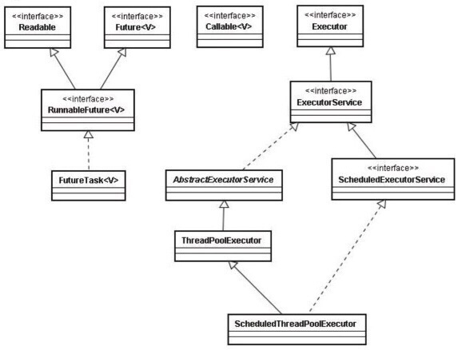
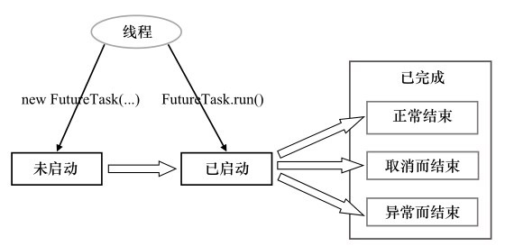

# 线程池的使用

<!-- TOC -->

- [线程池的使用](#%E7%BA%BF%E7%A8%8B%E6%B1%A0%E7%9A%84%E4%BD%BF%E7%94%A8)
  - [为什么要使用线程池](#%E4%B8%BA%E4%BB%80%E4%B9%88%E8%A6%81%E4%BD%BF%E7%94%A8%E7%BA%BF%E7%A8%8B%E6%B1%A0)
  - [Executor 框架概述](#executor-%E6%A1%86%E6%9E%B6%E6%A6%82%E8%BF%B0)
    - [Executor 框架主要由 3 大部分组成](#executor-%E6%A1%86%E6%9E%B6%E4%B8%BB%E8%A6%81%E7%94%B1-3-%E5%A4%A7%E9%83%A8%E5%88%86%E7%BB%84%E6%88%90)
    - [Executor 是基于生产者 -- 消费者模式的](#executor-%E6%98%AF%E5%9F%BA%E4%BA%8E%E7%94%9F%E4%BA%A7%E8%80%85----%E6%B6%88%E8%B4%B9%E8%80%85%E6%A8%A1%E5%BC%8F%E7%9A%84)
    - [Executor 框架的主要类和接口](#executor-%E6%A1%86%E6%9E%B6%E7%9A%84%E4%B8%BB%E8%A6%81%E7%B1%BB%E5%92%8C%E6%8E%A5%E5%8F%A3)
  - [线程池的基本使用方法](#%E7%BA%BF%E7%A8%8B%E6%B1%A0%E7%9A%84%E5%9F%BA%E6%9C%AC%E4%BD%BF%E7%94%A8%E6%96%B9%E6%B3%95)
  - [ThreadPoolExecutor](#threadpoolexecutor)
    - [FixedThreadPool](#fixedthreadpool)
    - [CacheThreadPool](#cachethreadpool)
    - [SingleThreadPool](#singlethreadpool)
    - [Remarks](#remarks)
    - [ScheduledThreadPoolExecutor](#scheduledthreadpoolexecutor)
  - [ThreadPoolExecutor 补充内容](#threadpoolexecutor-%E8%A1%A5%E5%85%85%E5%86%85%E5%AE%B9)
    - [`BlockingQueue<Runnable> workQueue` 的设置](#blockingqueuerunnable-workqueue-%E7%9A%84%E8%AE%BE%E7%BD%AE)
    - [`RejectedExecutionHandler handler` 的设置](#rejectedexecutionhandler-handler-%E7%9A%84%E8%AE%BE%E7%BD%AE)
  - [Future 接口 & FutureTask 实现类](#future-%E6%8E%A5%E5%8F%A3--futuretask-%E5%AE%9E%E7%8E%B0%E7%B1%BB)
  - [Runnable 接口 & Callable 接口](#runnable-%E6%8E%A5%E5%8F%A3--callable-%E6%8E%A5%E5%8F%A3)
  - [Executor 的生命周期](#executor-%E7%9A%84%E7%94%9F%E5%91%BD%E5%91%A8%E6%9C%9F)
  - [设置线程池的大小](#%E8%AE%BE%E7%BD%AE%E7%BA%BF%E7%A8%8B%E6%B1%A0%E7%9A%84%E5%A4%A7%E5%B0%8F)
    - [线程池过大过小的缺点](#%E7%BA%BF%E7%A8%8B%E6%B1%A0%E8%BF%87%E5%A4%A7%E8%BF%87%E5%B0%8F%E7%9A%84%E7%BC%BA%E7%82%B9)
    - [线程池大小的设置](#%E7%BA%BF%E7%A8%8B%E6%B1%A0%E5%A4%A7%E5%B0%8F%E7%9A%84%E8%AE%BE%E7%BD%AE)

<!-- /TOC -->

## 为什么要使用线程池

**我们希望应用程序是这样的：**

- 在正常的负载下，服务器应用程序应该同时表现出良好的吞吐量和快速的响应性；
- 当负荷过载时，应用程序的性能应该是逐渐降低，而不是直接失败。

**如果不使用线程池，为每一个任务都创建一个线程来执行，我们将会遇到如下问题：**

- 线程的创建和销毁都需要时间，会延迟请求的处理，并且消耗系统资源；
	- 尤其是内存，还会增加 GC 的压力；同时在系统崩溃的临界点，如果多创建一个线程，就会导致系统崩溃，而不是性能的缓慢下降。
- 如果线程数超过了 CPU 数，增加线程反而会降低性能，因为会出现频繁的上下文切换。

**合理使用线程池的好处：**

- 降低资源消耗：可以重复使用已经创建好的线程
- 提高响应速度：任务到达时，可以不需要等待线程创建的时间
- 提高线程的可管理性

## Executor 框架概述

通过 Executor 框架，我们可以将工作单元（Runnable & Callable）与执行机制（Executor）分离，即**将任务的提交和任务的执行分离**。

### Executor 框架主要由 3 大部分组成

- **任务：** 实现接口：Runnable 接口或 Callable 接口。
- **任务的执行：** 包括任务执行机制的核心接口 Executor，以及继承自 Executor 的 ExecutorService 接口。
	- Executor 框架有两个关键类实现了 ExecutorService 接口
		- ThreadPoolExecutor
		- ScheduledThreadPoolExecutor
- **异步计算的结果** ：接口 Future 和实现 Future 接口的 FutureTask 类。

### Executor 是基于生产者 -- 消费者模式的

- 提交任务的操作相当于生产者（生成待完成的工作单元）
- 执行任务的线程则相当于消费者（执行完这些工作单元）

### Executor 框架的主要类和接口

**Executor 接口：** 框架的基础，线程池都是实现自它的子接口的。

```java
public interface Executor {
    void execute(Runnable command);
}
```



**Executor 框架的主要成员：**

- ThreadPoolExecutor
- ScheduledThreadPoolExecutor
- Future 接口 & FutureTask 实现类
- Executors 工厂类

接下来，我们将一一介绍这些 Executor 框架的组件。在介绍这些组件之前，我们先来看一下线程池要如何使用。

## 线程池的基本使用方法

```java
public class ThreadPoolDemo {
    public static void main(String[] args) throws InterruptedException {
        ExecutorService pool = Executors.newFixedThreadPool(5);
        CountDownLatch latch = new CountDownLatch(15);  // 用来判断线程池是否可以关闭

        Runnable runnable = new Runnable() {
            @Override
            public void run() {
                try {
                    System.out.println("线程开始");
                    Thread.sleep(1000);
                    System.out.println("线程结束");
                    latch.countDown();
                } catch (InterruptedException e) {
                }
            }
        };

        for (int i = 0; i < 15; i++) {
            pool.execute(runnable);
        }
        latch.await();  // 等待线程池中的线程运行完毕
        System.out.println("finish");
        pool.shutdown();
    }
}
```

以上 Demo 运行之后，15 个线程不会一下执行完，而是会 5 个 5 个的往外蹦。

## ThreadPoolExecutor

ThreadPoolExecutor 是线程池的核心实现类，用来执行被提交的任务。一般通过 Executors 工具类创建，我们可以通过 Executor 创建如下三种 ThreadPoolExecutor：
- FixedThreadPool
- CacheThreadPool
- SingleThreadExecutor

接下来我们将分别介绍它们。

首先，我们需要介绍一下 ThreadPoolExecutor 的构造方法，因为以上三种 ThreadPoolExecutor 其实都是被赋予了不同的构造参数的 ThreadPoolExecutor 对象。

```java
public ThreadPoolExecutor(int corePoolSize,
                          int maximumPoolSize,
                          long keepAliveTime,
                          TimeUnit unit,
                          BlockingQueue<Runnable> workQueue,
                          ThreadFactory threadFactory,
                          RejectedExecutionHandler handler) { ... }
```

**参数说明：**

| 参数                     | 描述                                                         |
| ------------------------ | ------------------------------------------------------------ |
| corePoolSize             | 核心线程池大小，即没有执行任务时的线程池大小，只有在工作队列满了的情况下才会创建超出这个数量的线程 |
| maximumPoolSize          | 最大线程池的大小                                             |
| keepAliveTime            | 某个线程的空闲时间超过了存活时间，那么将被标记为可回收的     |
| BlockingQueue            | 用来暂时保存任务的工作队列                                   |
| RejectedExecutionHandler | 当 ThreadPoolExecutor 已经关闭或者达到了最大线程池大小并且工作队列已满时，调用 `execute()` 方法会调用 RejectedExecutionHandler handler 的 `rejectedExecution(Runnable r, ThreadPoolExecutor executor);` 方法 |

### FixedThreadPool

**特点：** 固定长度的线程池，每当提交一个任务时就创建一个线程，直到达到线程池的最大数量，如果某个线程由于发生了未预期的 Exception 而结束，那么线程池会补充一个新的线程。

**创建方法：**

```java
public static ExecutorService newFixedThreadPool(int nThreads) {
    return new ThreadPoolExecutor(nThreads, nThreads,  // 线程池大小不可扩展
                                  0L, TimeUnit.MILLISECONDS,  // 多余线程会被立即终止
                                  new LinkedBlockingQueue<Runnable>());  
    							// 使用容量为 Integer.MAX_VALUE 的工作队列
    							// 由于使用了无界队列，不会拒绝任务，所以不会调用 handler
}
```

### CacheThreadPool

**特点：** 可缓存的线程池，如果线程池的当前规模超过了处理需求时，那么将回收空闲的线程，而当需求增加时，则可以添加新的线程，线程池的规模不存在任何限制。

**创建方法：**

```java
public static ExecutorService newCachedThreadPool() {
    return new ThreadPoolExecutor(0, Integer.MAX_VALUE,  // 初始为0，线程池中的线程数是无界的
                                  60L, TimeUnit.SECONDS,
                                  new SynchronousQueue<Runnable>());  
}
```

> **注意：**
>
> - 池中不会有空闲线程，也不会有等待的线程
> - 一旦任务到达的速度大于线程池处理任务的速度，就会创建一个新的线程给任务
> - 与另外两个线程池不同的地方在于，这个工作队列并不是用来放还没有执行的任务的，而是用来放执行过任务后空闲下的线程的，空闲下来的线程会被：`SynchronousQueue#poll(keepAliveTime, TimeUnit.NANOSECONDS)` poll 到工作队列中等待 60s，如果这 60s 有新的任务到达了，这个线程就被派出去执行任务，如果没有，就销毁。

### SingleThreadPool

**特点：** 单个工作者线程来执行任务，如果这个线程异常结束，会创建另一个线程来替代。能确保依照任务在队列中的顺序来串行执行。

**创建方法：**

```java
public static ExecutorService newSingleThreadExecutor() {
    return new FinalizableDelegatedExecutorService
        (new ThreadPoolExecutor(1, 1,  // 线程池的大小固定为1
                                0L, TimeUnit.MILLISECONDS,
                                new LinkedBlockingQueue<Runnable>()));
    						  // 使用容量为 Integer.MAX_VALUE 的工作队列
}
```

### Remarks

- 在创建 ThreadPoolExecutor 初期，线程并不会立即启动，而是等到有任务提交时才会启动，除非调用 prestartAllCoreThreads
- 将线程池的 corePoolSize 设置为 0 且不使用 SynchronousQueue 作为工作队列会产生的奇怪行为：只有当线程池的工作队列被填满后，才会开始执行任务
	- 产生原因：如果线程池中的线程数量等于线程池的基本大小，那么仅当在工作队列已满的情况下ThreadPoolExecutor才会创建新的线程，如果线程池的基本大小为零并且其工作队列有一定的容量，那么当把任务提交给该线程池时，**只有当线程池的工作队列被填满后，才会开始执行任务，因为这个时候才会创建新的线程，在此之前，线程池只有在工作队列中等待任务，没有执行任务的线程。**

### ScheduledThreadPoolExecutor

**特点：** 可以在给定的延迟后运行命令，或者定期执行命令。比 Timer 更灵活，功能更强大。

**创建方法：** 也是通过 Executor 工具创建。

```java
public static ScheduledExecutorService newScheduledThreadPool(int corePoolSize) {
    return new ScheduledThreadPoolExecutor(corePoolSize);
}
```

然后可以通过 schedule 方法提交线程到线程池：

```java
public <V> ScheduledFuture<V> schedule(Callable<V> callable,
                                       long delay,
                                       TimeUnit unit)
```

**实现原理：**

- 使用 DelayWorkQueue 作为工作队列，ScheduledThreadPoolExecutor 会把待执行的任务 ScheduledFutureTask 放到工作队列中
- ScheduledFutureTask 中有以下 3 个主要的成员变量：
	- long time：表示该任务将要被执行的具体时间；
	- long sequenceNumber：表示任务被添加到 ScheduledThreadPoolExecutor 中的序号；
	- long period：表示任务执行的间隔周期。
- 任务执行的过程：
	- 线程从 DelayWorkQueue 中获取到期的任务；
	- 执行这个任务；
	- 修改这个任务的 time 为下一次的执行时间；
	- 将该任务再次 add 进 DelayWorkQueue。

**对比 Timer（Timer 的缺陷）**

- Timer 在执行所有定时任务时只会创建一个线程。如果有一个任务执行时间太长导致它后面的任务超时，那么后面超时的任务会立即执行，从而破坏了其他 TimerTask 的准时执行。线程池能弥补这个缺陷，因为它可以提供多个线程来执行延时任务和周期任务。
- 线程泄漏：Timer 线程并不捕获未检查异常，当 TimerTask 抛出未检查的异常时将终止定时线程。这种情况下，整个 Timer都会被取消，将导致已经被调度但尚未执行的 TimerTask 将不会再执行，新的任务也不能被调度。


## ThreadPoolExecutor 补充内容

### `BlockingQueue<Runnable> workQueue` 的设置

- **无界队列**
	- 使用无界队列的线程池
		- newFixedThreadPool
		- newSingleThreadExecutor
	- BlockingQueue 选择
		- 无界的 LinkedBlockingQueue
- **有界队列** （可以避免资源耗尽，队列满了的处理方法请看下小节：`RejectedExecutionHandler handler` 的设置）
	- 只有当任务相互独立时，为线程池或工作队列设置界限才是合理的。如果任务之间存在依赖性，那么有界的线程池或队列就可能导致线程“饥饿”死锁问题
		- BlockingQueue 选择
			- ArrayBlockingQueue
			- 有界的 LinkedBlockingQueue
			- PriorityBlockingQueue
- **同步移交** （SynchronousQueue）

	- newCachedThreadPool 中使用
	- 对于非常大的或者无界的线程池，可以通过使用 SynchronousQueue 来避免任务排队
	- SynchronousQueue 不是一个真正的队列，而是一种在线程之间进行移交的机制
	- 要将一个元素放入 SynchronousQueue 中，必须有另一个线程正在等待接受这个元素。如果没有线程正在等待，并且线程池的当前大小小于最大值，那么 ThreadPoolExecutor 将创建一个新的线程，否则这个任务将被拒绝。

### `RejectedExecutionHandler handler` 的设置

JDK 提供了 4 种 RejectedExecutionHandler 接口的实现，它们都是以 ThreadPoolExecutor 类的静态内部类的形式定义的，它们的具体实现以及拒绝策略如下：

- **AbortPolicy** （默认）（Abort：流产）

  - 抛出未检查的 RejectedExecutionException，调用者自己捕获处理

  - 实现：

  	```java
  	public static class AbortPolicy implements RejectedExecutionHandler {
  	    public AbortPolicy() { }
  	
  	    public void rejectedExecution(Runnable r, ThreadPoolExecutor e) {
  	        throw new RejectedExecutionException("Task " + r.toString() +
  	                                             " rejected from " +
  	                                             e.toString()); // 抛异常！
  	    }
  	}
  	```

  - 这个是 ThreadPoolExecutor 的默认的 RejectedExecutionHandle handler，ThreadPoolExecutor 中有一个：

  	```java
  	private static final RejectedExecutionHandler defaultHandler = new AbortPolicy();
  	```

  	如果调用 ThreadPoolExecutor 的构造方法时没有给出 RejectedExecutionHandle 参数的话，它就会将上面的 defaultHandler 作为参数构造 ThreadPoolExecutor 对象，像这样：

  	```java
  	public ThreadPoolExecutor(int corePoolSize,
  	                          int maximumPoolSize,
  	                          long keepAliveTime,
  	                          TimeUnit unit,
  	                          BlockingQueue<Runnable> workQueue) {
  	    this(corePoolSize, maximumPoolSize, keepAliveTime, unit, workQueue,
  	         Executors.defaultThreadFactory(), defaultHandler); // 默认传入了 defaultHandler
  	}
  	```
- **DiscardPolicy** （Discard：抛弃）

  - 抛弃新提交的任务

  - 实现：它的 `rejectedExecution` 方法啥都没干……

  	```java
  	public static class DiscardPolicy implements RejectedExecutionHandler {
  	    public DiscardPolicy() { }
  	
  	    public void rejectedExecution(Runnable r, ThreadPoolExecutor e) {
  	    }
  	}
  	```
- **DiscardOldestPolicy** 
  - 抛弃下一个被执行的任务，然后重新尝试提交任务

  - 实现：

  	```java
  	public static class DiscardOldestPolicy implements RejectedExecutionHandler {
  	    public DiscardOldestPolicy() { }
  	    
  	    public void rejectedExecution(Runnable r, ThreadPoolExecutor e) {
  	        if (!e.isShutdown()) { // 先判断线程池关没
  	            e.getQueue().poll(); // 丢到等待队列中下一个要被执行的任务
  	            e.execute(r); // 重新尝试提交新来的任务
  	        }
  	    }
  	}
  	```

  - 不要和 PriorityBlockingQueue 一起使用，会丢失优先级最高的任务
- **CallerRunsPolicy** （既不抛出异常，也不抛弃任务）
  - 它不会在线程池中执行该任务，而是在调用 execute 提交这个任务的线程执行

  - 如当主线程提交了任务时，任务队列已满，此时该任务会在主线程中执行。这样主线程在一段时间内不会提交任务给线程池，使得工作者线程有时间来处理完正在执行的任务

  - 可以实现服务器在高负载下的性能缓慢降低

  - 提交任务的应用程序被拿去执行任务了，不会返回 accept，TCP 层的请求队列会被填满而抛弃请求，客户端才会反应过来，即可以通过 TCP 层来缓冲一下

  - 实现：

  	```java
  	public static class CallerRunsPolicy implements RejectedExecutionHandler {
  	    public CallerRunsPolicy() { }
  	
  	    public void rejectedExecution(Runnable r, ThreadPoolExecutor e) {
  	        if (!e.isShutdown()) {
  	            // 直接在把它提交来的线程调用它的 run 方法，相当于没有新建一个线程来执行它，
  	            // 而是直接在提交它的线程执行它，这样负责提交任务的线程一段时间内不会提交新的任务来
  	            r.run(); 
  	        }
  	    }
  	}
  	```

> ThreadPoolExecutor 的饱和策略可以通过调用 setRejectedExecutionHandler 来修改。


## Future 接口 & FutureTask 实现类

Future 接口 & FutureTask 实现类表示异步运算的结果，截至至 Java 8，FutureTask 是 Future 接口唯一的实现类。

**FutureTask 的状态迁移：**



**FutureTask 的 get 和 cancel 执行效果：**


**Future 的 get 方法对于任务的状态的不同表现：**

- 任务已完成：立即返回结果或抛出异常。
- 任务未完成：阻塞直到任务完成。
- 任务抛出异常：将异常封装为 ExecutionException 后再次抛出，ExecutionException 异常可以通过 getCause() 方法获取被封装的初始异常。
- 任务被取消：抛出 CancallationException 异常，这是个 RuntimeException，需要显式 catch。


## Runnable 接口 & Callable 接口

Java 创建线程的三种方式：

- extends Thread
- implements Runnable
- implements Callable

Callable 接口是比 Runnable 更好的基本任务表示形式，它任务主入口点 call 将返回一个值或者抛出一个异常。

```java
public interface Callable<V> {
    V call() throws Exception;
}
// 如果想要使用无返回值的 Callable，可以使用 Callable<Void>
```


## Executor 的生命周期

**Executor 的生命周期方法：**

```java
public interface ExecutorService extends Executor {
    // shutdown方法将执行平缓的关闭过程：
    // 不再接受新的任务，同时等待已经提交的任务执行完成（包括那些还未开始执行的任务）
    void shutdown();

    // 执行粗暴的关闭过程：
    // 它将尝试取消所有运行中的任务，并且不再启动队列中尚未开始执行的任务
    List<Runnable> shutdownNow();

    boolean isshutdown();

    // 返回ExecutorService是否已经终止
    boolean isTerminated();

    // 等待ExecutorService到达终止状态，一般调用完它之后立即调用shutdown
    boolean awaitTermination(long timeout，TimeUnit unit)
        throws InterruptedException;
    // ...
}
```

**ExecutorService的生命周期的3种状态：**

- **运行：** 初始创建的时候。
- **关闭：** 调用 shutdown 和 shutdownNow，关闭任务
	- 在 ExecutorService 关闭后提交的任务将由“拒绝执行处理器（RejectedExecutionHandler）”来处理，它会抛弃任务，或者使得 execute 方法抛出一个未检查的 RejectedExecutionException（RuntimeException异常）
- **已终止：** 等所有任务都完成后，ExecutorService 将转入终止状态
	- 可以调用 awaitTermination 等待 ExecutorService 到达终止状态
	- 可以通过调用 isTerminated 来轮询 ExecutorService 是否已经终止


## 设置线程池的大小

### 线程池过大过小的缺点

- 过大
	- 大量线程将在很少的 CPU 资源上发生竞争
	- 大量空闲线程会耗费内存，导致资源耗尽
- 过小
	- CPU 闲置，系统吞吐率下降

### 线程池大小的设置

- **计算密集型任务：** N = N_cpu + 1
	- 加 1 的原因：当有一个线程偶尔故障时，额外的那个线程可以立即补上，保证CPU时钟不会被浪费
- **包含 I/O 或其他阻塞操作：** N = N_cpu * U_cpu * (1 + W / C)
	- N_cpu：CPU 的个数
	- U_cpu：目标 CPU 利用率
	- W / C：等待时间 (Wait) / 计算时间 (Compute)
	- 获取 CPU 数目的方法：`int N_CPUS = Runtime.getRuntime().availableProcessors();`

