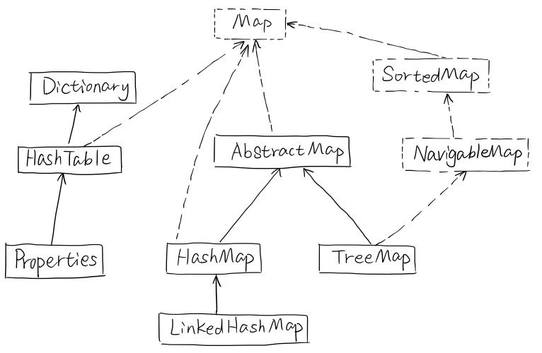
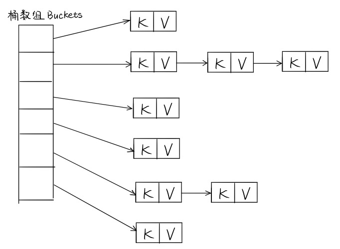

# 对比 HashMap & HashTable & TreeMap

<!-- TOC -->

- [对比 HashMap & HashTable & TreeMap](#%E5%AF%B9%E6%AF%94-hashmap--hashtable--treemap)
  - [基本区别](#%E5%9F%BA%E6%9C%AC%E5%8C%BA%E5%88%AB)
  - [HashMap 源码分析](#hashmap-%E6%BA%90%E7%A0%81%E5%88%86%E6%9E%90)
    - [HashMap 内部结构](#hashmap-%E5%86%85%E9%83%A8%E7%BB%93%E6%9E%84)
    - [容量、负载因子和树化](#%E5%AE%B9%E9%87%8F%E8%B4%9F%E8%BD%BD%E5%9B%A0%E5%AD%90%E5%92%8C%E6%A0%91%E5%8C%96)

<!-- /TOC -->

## 基本区别

它们都是最常见的 Map 实现，是以键值对的形式存储数据的容器类型。

- HashTable
  - 线程安全，不支持 null 作为键或值，它的线程安全是通过在所有方法 public 方法上加 synchronized 实现的，所以性能很差，很少使用。
- HashMap
	- 不是线程安全的，但是支持 null 作为键或值，是绝大部分利用键值对存取场景的首选，put 和 get 基本可以达到常数级别的时间复杂度。
- TreeMap
	- 基于红黑是的一种提供顺序访问的 Map，它的 get，put，remove 等操作是 O(log(n)) 级别的时间复杂度的（因为要保证顺序），具体的排序规则可以由 Comparator 指定：`public TreeMap(Comparator<? super K> comparator)`。

它们的简单类图如下：



在对 Map 的顺序没有要求的情况下，HashMap 基本是最好的选择，不过 HashMap 的性能十分依赖于 hashCode 的有效性，所以必须满足：

- equals 判断相等的对象的 hashCode 一定相等
- 重写了 hashCode 必须重写 equals

我们注意到，除了 TreeMap，LinkedHashMap 也可以保证某种顺序，它们的 **区别** 如下：

- LinkedHashMap：提供的遍历顺序符合插入顺序，是通过为 HashEntry 维护一个双向链表实现的。
- TreeMap：顺序由键的顺序决定，依赖于 Comparator。


## HashMap 源码分析

### HashMap 内部结构

HashMap 的内部结构如下：



> 解决哈希冲突的常用方法：
>
> - 开放地址法：出现冲突时，以当前哈希值为基础，产生另一个哈希值。
> - 再哈希法：同时构造多个不同的哈希函数，发生冲突就换一个哈希方法。
> - 链地址法：将哈希地址相同的元素放在一个链表中，然后把这个链表的表头放在哈希表的对应位置。
> - 建立公共溢出区：将哈希表分为基本表和溢出表两部分，凡是和基本表发生冲突的元素，一律填入溢出表。

HashMap 采用的是链表地址法，不过如果由一个位置的链表比较长了（超过阈值 8 了），链表会被改造为树形结构以提高查找性能。

这个桶数组并没有在 HashMap 的构造函数中初始化好，只是设置了容量（默认初始容量为 16），应该是采用了 lazy-load 原则。

```java
public HashMap(int initialCapacity, float loadFactor){  
    // ... 
    this.loadFactor = loadFactor;
    this.threshold = tableSizeFor(initialCapacity);
}
```

接下来，我们看一下 put 方法：

```java
public V put(K key, V value) {
    return putVal(hash(key), key, value, false, true);
}
```

可以看到，put 方法调用了 putVal 方法：

```java
final V putVal(int hash, K key, V value, boolean onlyIfAbsent,
               boolean evict) {
    Node<K,V>[] tab; Node<K,V> p; int n, i;
    // lazy-load，tab要是空的，用resize初始化它
    // resize既要负责初始化，又要负责在容量不够时扩容
    if ((tab = table) == null || (n = tab.length) == 0)
        n = (tab = resize()).length;
    // 无哈希冲突，直接new一个节点放到tab[i]就行
    // 具体键值对在哈希表中的位置：i = (n - 1) & hash
    if ((p = tab[i = (n - 1) & hash]) == null)
        tab[i] = newNode(hash, key, value, null);
    else {
        Node<K,V> e; K k;
        // 该key存在，直接修改value就行
        if (p.hash == hash &&
            ((k = p.key) == key || (key != null && key.equals(k))))
            e = p;
        // 当前hashCode下面挂的已经是颗树了，用树的插入方式插入新节点
        else if (p instanceof TreeNode)
            e = ((TreeNode<K,V>)p).putTreeVal(this, tab, hash, key, value);
        // 当前hashCode下面挂的还是个链表，不过保不齐会变成颗树
        else {
            // ...
            if (binCount >= TREEIFY_THRESHOLD - 1) // 链表要变树啦！
                treeifyBin(tab, hash);
            // ...
        }
    }
    ++modCount;
    if (++size > threshold) // 容量不够了，扩容
        resize();
}
```

**分析：**

- key 的 hashCode 用的并不是 key 自己的 hashCode，而是通过 HashMap 内部的一个 hash 方法另算的。那么为什么要另算一个 hashCode 呢？这是因为： **有些数据计算出的哈希值差异主要在高位，而 HashMap 里的哈希寻址是忽略容量以上的高位的，这种处理可以有效避免这种情况下的哈希碰撞。**

	```java
	static final int hash(Object key) {
	    int h;
	    return (key == null) ? 0 : (h = key.hashCode()) ^ (h >>> 16);
	}
	```

- **resize 方法：** （重点！这个方法和以前写的有点不一样了……）现在的写法不会出现链表扩容时发生死循环了，以前的写法相当于将 oldTab 上的 Node 一个一个卸下来，然用头插法的方式插入到 newTab 的对应位置，因为用的是头插法，会给链表倒序，这种倒序导致了在多线程时，链表的两个 Node 的 next 可能会互相指向对方，出现死循环（[详见此文](https://mailinator.blogspot.com/2009/06/beautiful-race-condition.html)）。现在的方法是使用尾插法，即不会改变链表原来在 oldTab 挂着的时候的相对顺序，在 `oldTab[j]` 处的链表会根据 hash 值分成 lo 和 hi 两个链表，然后分别挂在 newTab 的 `newTab[j]` 和 `newTab[j + oldCap]` 两个不同的位置。

  ```java
  final Node<K,V>[] resize() {
      Node<K,V>[] oldTab = table;
      // oldTab 的长度，一定是 2 的幂，也就是说，二进制只有一位为 1
      int oldCap = (oldTab == null) ? 0 : oldTab.length;
      int oldThr = threshold;
      int newCap, newThr = 0;
      if (oldCap > 0) {
          // MAXIMUM_CAPACITY = 1 << 30，如果超过这个容量就扩不了容了
          if (oldCap >= MAXIMUM_CAPACITY) {
              threshold = Integer.MAX_VALUE;
              return oldTab;
          }
          // newCap = oldCap << 1，容量变成原来的 2 倍
          else if ((newCap = oldCap << 1) < MAXIMUM_CAPACITY &&
                   oldCap >= DEFAULT_INITIAL_CAPACITY)
              newThr = oldThr << 1; // double threshold
      }
      else if (oldThr > 0) // initial capacity was placed in threshold
          newCap = oldThr;
      else {               // zero initial threshold signifies using defaults
          newCap = DEFAULT_INITIAL_CAPACITY;
          newThr = (int)(DEFAULT_LOAD_FACTOR * DEFAULT_INITIAL_CAPACITY);
      }
      if (newThr == 0) {
          float ft = (float)newCap * loadFactor;
          newThr = (newCap < MAXIMUM_CAPACITY && ft < (float)MAXIMUM_CAPACITY ?
                    (int)ft : Integer.MAX_VALUE);
      }
      threshold = newThr;
      @SuppressWarnings({"rawtypes","unchecked"})
      Node<K,V>[] newTab = (Node<K,V>[])new Node[newCap];
      table = newTab;
      // 把 oldTab 中的数据移到 newTab 中，这里是要进行 rehash 的
      if (oldTab != null) {
          for (int j = 0; j < oldCap; ++j) {
              Node<K,V> e;
              if ((e = oldTab[j]) != null) { // 把 oldTab 中的非 null 元素放到 newTab 去
                  oldTab[j] = null; // 把链表从 oldTab[j] 上取下来
                  if (e.next == null) // oldTab[j] 处只有一个元素
                      newTab[e.hash & (newCap - 1)] = e;
                  else if (e instanceof TreeNode) // oldTab[j] 处是一颗树
                      ((TreeNode<K,V>)e).split(this, newTab, j, oldCap);
                  else { // oldTab[j] 处是一个长度不超过 8 链表
                      Node<K,V> loHead = null, loTail = null;
                      Node<K,V> hiHead = null, hiTail = null;
                      Node<K,V> next;
                      do {
                          next = e.next;
                          /* 重点！！！
                          下面将根据 (e.hash & oldCap) == 0 将原来 oldTab[j] 处的链表分成
                          lo 和 hi 两个链表，为什么要这么分呢？
                          因为挂在 oldTab[j] 处的节点都是 hash % oldCap == j 的，但是现在，
                          hash % newCap 的结果有了以下两种可能：
                          - hash % newCap == j；
                          - hash % newCap == j + oldCap。
                          如何区分这两种情况呢？就是通过 (e.hash & oldCap) == 0 来区分的，
                          - 如果 (e.hash & oldCap) == 0，为 hash % newCap == j；
                          - 如果 (e.hash & oldCap) != 0，为 hash % newCap == j + oldCap。
                          */
                          if ((e.hash & oldCap) == 0) {
                              if (loTail == null) // 第一次执行 do-while 循环
                                  loHead = e; // 用 loHead 记录 oldTab[j] 处链表的第一个 Node
                              else // 非第一次执行 do-while 循环
                                  loTail.next = e; // 把当前节点 e 挂到 lo 链表上
                              loTail = e; // 移动 lo 链表的尾结点指针到当前节点 e
                          }
                          else { // hi 链表的处理方式和上面的 lo 链表一样
                              if (hiTail == null)
                                  hiHead = e;
                              else
                                  hiTail.next = e;
                              hiTail = e;
                          }
                      } while ((e = next) != null);
                      if (loTail != null) { // 如果 lo 链表不为空
                          loTail.next = null;
                          newTab[j] = loHead; // 把 lo 链表挂到 newTab[j] 上
                      }
                      if (hiTail != null) { // 如果 hi 链表不为空
                          hiTail.next = null;
                          newTab[j + oldCap] = hiHead; // 把 hi 链表挂到 newTab[j + oldCap] 上
                      }
                  }
              }
          }
      }
      return newTab;
  }
  ```


### 容量、负载因子和树化

容量和负载因子决定了桶数组中的桶数量，如果桶太多了会浪费空间，但桶太少又会影响性能。我们要保证：

```
负载因子 * 容量 > 元素数量 && 容量要是 2 的倍数
```

对于负载因子：

- 如果没有特别需求，不要轻易更改；
- 如果需要调整，不要超过 0.75，否则会显著增加冲突；
- 如果使用太小的负载因子，也要同时调整容量，否则可能会频繁扩容，影响性能。

那么为什么要树化呢？

这本质上是一个安全问题，我们知道如果同一个哈希值对应位置的链表太长，会极大的影响性能，而在现实世界中，构造哈希冲突的数据并不是十分复杂的事情，恶意代码可以利用这些数据与服务端进行交互，会导致服务端 CPU 大量占用，形成哈希碰撞拒绝服务攻击。

