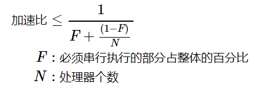

# Java 程序的性能评估

<!-- TOC -->

- [Java 程序的性能评估](#java-程序的性能评估)
    - [应用程序性能评估](#应用程序性能评估)
    - [Amdahl 定律](#amdahl-定律)
    - [线程引入的开销](#线程引入的开销)
        - [上下文切换](#上下文切换)
        - [阻塞（锁竞争失败）](#阻塞锁竞争失败)
            - [JVM 在实现阻塞操作时有两种方法](#jvm-在实现阻塞操作时有两种方法)
    - [减少锁的竞争](#减少锁的竞争)
        - [三种降低锁竞争程度的方式](#三种降低锁竞争程度的方式)
            - [减少锁的持有时间](#减少锁的持有时间)
            - [降低锁的请求频率：减小锁的粒度，即锁分解和锁分段！！！](#降低锁的请求频率减小锁的粒度即锁分解和锁分段)
            - [使用有协调机制的独占锁，允许更高的并发性](#使用有协调机制的独占锁允许更高的并发性)
        - [监测CPU的利用率](#监测cpu的利用率)
            - [CPU 没有得到充分利用的原因](#cpu-没有得到充分利用的原因)
            - [如何提高程序的可伸缩性](#如何提高程序的可伸缩性)
        - [应用示例：减小日志方法的上下文切换开销](#应用示例减小日志方法的上下文切换开销)

<!-- /TOC -->

## 应用程序性能评估

- **运行速度：** 指定的任务单元需要多久才能处理完。
	- 响应性：请求从发出到完成的时间（时延）
- **处理能力：** 在计算资源一定的情况下，能完成多少工作。
	- 生产量：一定时间能处理多少数据
	- 吞吐量：一组任务中已完成任务所占的比例
	- 可伸缩性：增加资源（通常是CPU）后吞吐量的提升


## Amdahl 定律

**Amdahl 定律描述：** 在增加计算资源的情况下，程序在理论上能实现的最高加速比。用于分析多处理器下的性能。

**任务中的串行部分：**

- 从任务队列中取任务
- 处理多个线程的运算结果

**加速比上界公式：**



**公式解释：**

如果程序中完全不存在串行部分 F，那么加速比最大为 N，因为存在串行部分，所以要用 1 除以 串行部分加上可以用 N 个处理器并行执行的并行部分：(1 - F) / N。


## 线程引入的开销

### 上下文切换

- **产生原因：** 可运行的线程数大于CPU的数量，那么操作系统最终会将某个正在运行的线程调度出来，从而使其他线程能够使用CPU。
- **切换的过程：** 保存当前运行线程的执行上下文，并将新调度进来的线程的执行上下文设置为当前上下文。当任务在运行和阻塞这两个状态之间转换时，就相当于一次上下文切换。
- **判断方式：** 如果内核占用率较高（超过10%），那么通常表示调度活动发生得很频繁，这很可能是由 I/O 或竞争锁导致的阻塞引起的。
- **如何减少上下文切换？**
	- 无锁并发编程，如将数据 ID 按照 Hash 算法取模分段，不同线程处理不同段数据；
	- CAS 非阻塞同步机制；
	- 避免创建不需要的线程；
	- 协程：在单线程中实现多线程的调度，并在单线程中维持多个任务间的切换。

### 阻塞（锁竞争失败）

#### JVM 在实现阻塞操作时有两种方法

- **自旋等待（循环不断尝试获取锁直到成功）：** 适合等待时间短，不会发生上下文切换。
- **操作系统挂起被阻塞线程：** 适合等待时间长。
	- 会发生两次上下文切换
		- 交换出去一次
		- 切换回来一次
	- 会发生必要的操作系统操作和缓存操作


## 减少锁的竞争

锁竞争会导致：串行操作会降低可伸缩性，并且会发生两次上下文切换会降低性能。

### 三种降低锁竞争程度的方式

#### 减少锁的持有时间

```java
public class BetterAttributeStore {
    @GuardedBy("this") private final Map<String, String>
            attributes = new HashMap<String, String>();
    public boolean userLocationMatches(String name, String regexp) {
        String key = "users." + name + ".location";
        String location;
        synchronized (this) { // 把本来加在方法上的synchronized的范围缩小
            location = attributes.get(key);
        }
        if (location == null)
            return false;
        else
            return Pattern.matches(regexp, location);
    }
}
```

#### 降低锁的请求频率：减小锁的粒度，即锁分解和锁分段！！！

即把一个锁拆分成多个锁，但是会增大发生死锁的危险。

**锁分解：** 不同数据使用不同的锁。

```java
public class ServerStatusAfterSplit {
    // 以下两个成员用不同的锁保护
    @GuardedBy("users") public final Set<String> users;
    @GuardedBy("queries") public final Set<String> queries;
    public ServerStatusAfterSplit() {
        users = new HashSet<String>();
        queries = new HashSet<String>();
    }
    public void addUser(String u) {
        synchronized (users) {
            users.add(u);
        }
    }
    public void addQuery(String q) {
        synchronized (queries) {
            queries.add(q);
        }
    }
}
```

**锁分段：** 不同线程在同一数据的不同部分上不会互相干扰，常用于集合。不过会导致实现集合的独占访问困难且开销高。`ConcurrentHashMap` 就是通过锁分段，使用 16 个锁保护数据的不同部分，达到最大可以支持 16 个线程并发写入的操作的。

```java
public class StripedMap {
    // 同步策略：buckets[n]由locks[n % N_LOCKS]保护
    private static final int N_LOCKS = 16;
    private final Node[] buckets;
    private final Object[] locks; // N_LOCKS个锁
    private static class Node {
        Node next;
        Object key;
        Object value;
    }
    public StripedMap(int numBuckets) {
        buckets = new Node[numBuckets];
        locks = new Object[N_LOCKS];
        for (int i = 0; i < N_LOCKS; i++)
            locks[i] = new Object();
    }
    private final int hash(Object key) {
        return Math.abs(key.hashCode() % buckets.length);
    }
    public Object get(Object key) {
        int hash = hash(key);
        synchronized (locks[hash % N_LOCKS]) { // 分段加锁
            for (Node m = buckets[hash]; m != null; m = m.next)
                if (m.key.equals(key))
                    return m.value;
        }
        return null;
    }
    public void clear() {
        for (int i = 0; i < buckets.length; i++) {
            synchronized (locks[i % N_LOCKS]) { // 分段加锁
                buckets[i] = null;
            }
        }
    }
}
```

#### 使用有协调机制的独占锁，允许更高的并发性

- 并发容器
- 读写锁 ReadWriteLock：多个读取操作单个写入操作情况下的加锁规则
- 不可变对象
- 原子变量

### 监测CPU的利用率

#### CPU 没有得到充分利用的原因

- **负载不充分：** 测试程序没有足够多的负载
- **I/O 密集：** 花费了大量的时间等待 I/O 或网络通信的结果，CPU 利用率自然不高
	- 判断磁盘 I/O 操作是否密集
	- 监测网络的通信流量级别
- **外部限制：** 使用分析工具或数据库管理工具判断等待外部服务的结果需要多少时间
- **锁竞争**：
	- 使用分析工具分析程序的锁竞争程度，以及是哪些锁存在激烈竞争
	- 随机取样，触发线程缓存，在其中查找发生锁竞争的线程

#### 如何提高程序的可伸缩性

- vmstat 输出：查看当前处于可运行状态，但由于没有足够的 CPU 数而没有运行的线程数
- 如果 CPU 的利用率很高，在等待的线程也很多，这时增加 CPU 数会提高程序的性能

### 应用示例：减小日志方法的上下文切换开销

在服务器应用程序中，发生阻塞的原因之一就是在处理请求时产生各种日志消息。减少日志的上下文切换次数可以提高吞吐量。

**方法：**

- 调用 log 方法的线程将不会因为等待输出流的锁或者 I/O 完成而被阻塞，它们只将消息放入队列，然后就返回到各自的任务中。即通过将 I/O 操作从处理请求的线程中分离出来，缩短处理请求的平均服务时间。
- 虽然在消息队列上可能会发生竞争，但 put 操作相对于记录日志的 I/O 操作是一种更为轻量级的操作。
- 然后将 I/O 操作移到了另一个用户感知不到开销的线程上，即有一个消费者线程不断的在后台从消息队列中取任务，自己在后台慢慢做。

**比喻：**

- 类似于两种不同救火方案之间的差异：
	- 第一种方案是所有人排成一队，一个人按顺序浇一桶水灭火；
	- 第二种方案是每个人都拿着一个水桶去救火；
- 第二种方法看起来很好，但是其在水源和着火点存在更大的竞争，效率其实更低。好比中断会干扰人们的工作并降低效率，阻塞和上下文切换同样会干扰线程的正常执行。