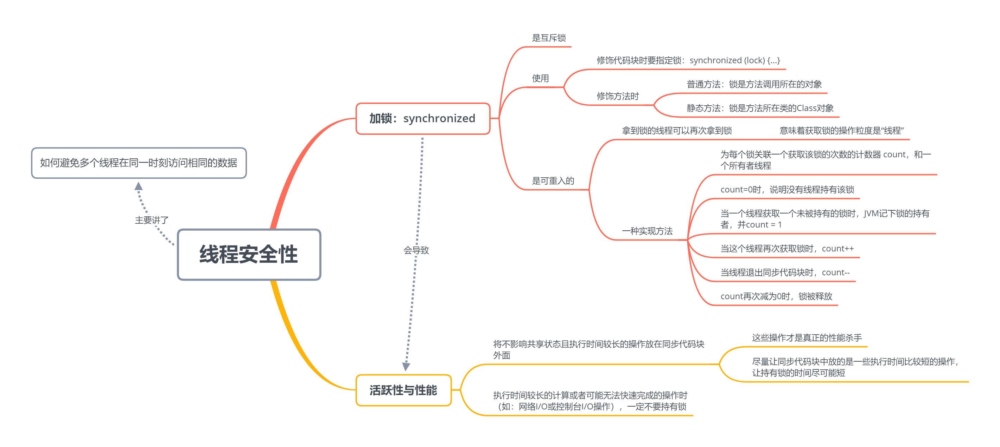

# 线程的安全性

线程安全性主要解决了如何避免多个线程在同一时刻访问同一个数据的问题，它主要通过加锁的方式，使得多个线程排成一队，一个一个的访问数据，也是由于这个原因，通过这种方式保证线程安全会对应用的性能产生影响。

## 加锁：synchronized

synchronized 是互斥锁，也就是说，在同一时刻，它只允许一个线程拿到锁对象，它有如下两种使用方法：

### 使用方法

**修饰代码块：**

```java
synchronized (lock对象) {
    // 同步代码块
}
```

**修饰方法：**

修饰普通方法：（锁是调用方法的对象）

```java
synchronized public void getValue() {...}
```

修饰静态方法：（锁是该方法所在的 Class 对象）

```java
synchronized public static void getValue() {...}
```

### synchronized 锁是可重入的

拿到锁的线程可以再次拿到锁，这意味着获取锁的操作粒度是“线程”。

**可重入锁的一种实现方式：**

- 为每个锁关联一个获取该锁的次数的计数器 count，和一个所有者线程；
- count=0时，说明没有线程持有该锁；
- 当一个线程获取一个未被持有的锁时，JVM 记下锁的持有者，并 count = 1；
- 当这个线程再次获取锁时，count++；
- 当线程退出同步代码块时，count--；
- 当 count 再次减为 0 时，锁被释放。

### 如何减小 synchronized 对应用性能的影响

- 将不影响共享状态且执行时间较长的操作放在同步代码块外面，尽量让同步代码块中放的是一些执行时间比较短的操作，让持有锁的时间尽可能短。
- 执行时间较长的计算或者可能无法快速完成的操作时（如：网络I/O或控制台I/O操作），一定不要持有锁！